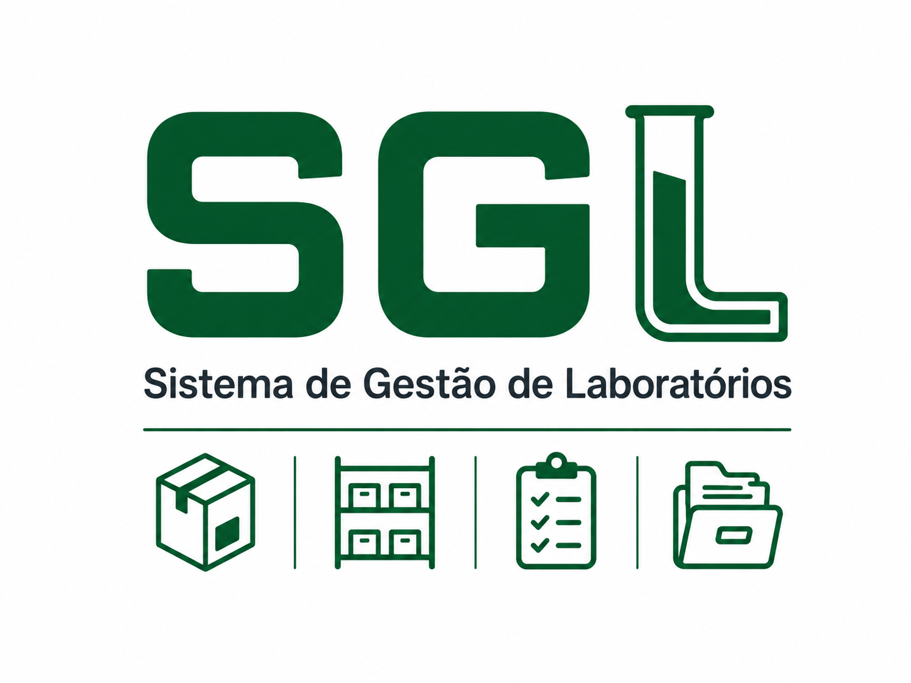
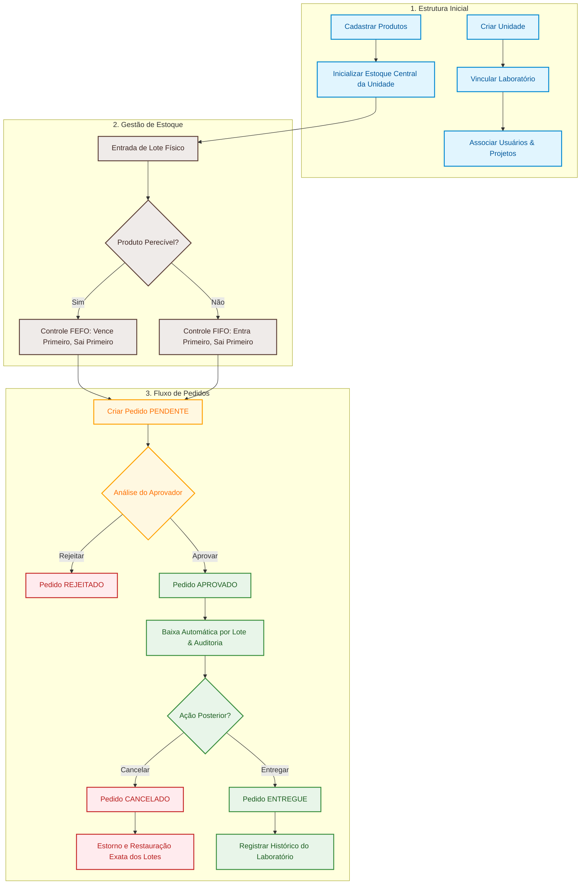

<a id="readme-top"></a>

<!-- HERO SECTION -->
<div align="center">
  <a href="https://github.com/gbsalermo/Sistema-SGL">
    
  </a>

  <h1 align="center">SGL — Sistema de Gestão de Laboratórios</h1>

  <p align="center">
    <strong>Plataforma corporativa e inteligente para gestão de insumos, controle de estoque com rastreabilidade física por lotes (FEFO/FIFO), fluxo de aprovação de pedidos e auditoria para laboratórios de pesquisa.</strong>
  </p>

  <p align="center">
    <a href="http://localhost:8080/swagger-ui/index.html"><strong>Explorar Swagger UI »</strong></a>
    ·
    <a href="docs/FLUXO_DO_SISTEMA.md">Ver Fluxo do Sistema</a>
    ·
    <a href="docs/ENDPOINTS_INTERNOS.md">Consultar Endpoints</a>
  </p>

  <!-- BADGES -->
  <p align="center">
    <a href="https://www.oracle.com/java/"></a>
    <a href="https://spring.io/projects/spring-boot"></a>
    <a href="https://www.postgresql.org/"></a>
    <a href="https://flywaydb.org/"></a>
    <a href="http://localhost:8080/swagger-ui/index.html"></a>
    <a href="#-testes-automatizados"></a>
    
  </p>
</div>

<br />

<!-- QUICK NAVIGATION -->
<div align="center">
  <a href="#-sobre-o-projeto">Sobre o Projeto</a> •
  <a href="#-principais-funcionalidades">Funcionalidades</a> •
  <a href="#-tecnologias-utilizadas">Tecnologias</a> •
  <a href="#-fluxo-operacional-e-regras-de-negócio">Fluxo & Regras</a> •
  <a href="#-começando">Como Executar</a> •
  <a href="#-documentação-da-api--swagger">API & Swagger</a> •
  <a href="#-roadmap">Roadmap</a> •
  <a href="#-autor">Autor</a>
</div>

<br />

---

<!-- TABLE OF CONTENTS -->
<details>
  <summary>📋 <strong>Tabela de Conteúdos (Clique para expandir)</strong></summary>
  <ol>
    <li>
      <a href="#-sobre-o-projeto">Sobre o Projeto</a>
      <ul>
        <li><a href="#-o-problema-e-a-solução">O Problema e a Solução</a></li>
        <li><a href="#-arquitetura-do-sistema">Arquitetura do Sistema</a></li>
        <li><a href="#-modelo-do-domínio">Modelo do Domínio</a></li>
      </ul>
    </li>
    <li><a href="#-tecnologias-utilizadas">Tecnologias Utilizadas</a></li>
    <li><a href="#-principais-funcionalidades">Principais Funcionalidades</a></li>
    <li>
      <a href="#-fluxo-operacional-e-regras-de-negócio">Fluxo Operacional e Regras de Negócio</a>
      <ul>
        <li><a href="#-diagrama-de-ciclo-de-vida-sgl">Diagrama de Ciclo de Vida</a></li>
        <li><a href="#-regras-fefo-e-fifo">Regras FEFO e FIFO</a></li>
        <li><a href="#-auditoria-e-movimentações">Auditoria e Movimentações</a></li>
      </ul>
    </li>
    <li>
      <a href="#-começando">Começando (Guia de Instalação e Execução)</a>
      <ul>
        <li><a href="#pré-requisitos">Pré-requisitos</a></li>
        <li><a href="#instalação-e-configuração">Instalação e Configuração</a></li>
        <li><a href="#execução-da-aplicação">Execução da Aplicação</a></li>
        <li><a href="#testes-automatizados">Testes Automatizados</a></li>
      </ul>
    </li>
    <li>
      <a href="#-documentação-da-api--swagger">Documentação da API & Swagger</a>
      <ul>
        <li><a href="#-acesso-ao-swagger-ui">Acesso ao Swagger UI</a></li>
        <li><a href="#-guia-prático-de-uso-passo-a-passo">Guia Prático de Uso Passo a Passo</a></li>
        <li><a href="#-resumo-dos-endpoints">Resumo dos Endpoints</a></li>
      </ul>
    </li>
    <li><a href="#-roadmap">Roadmap e Status do Projeto</a></li>
    <li><a href="#-documentação-adicional">Documentação Adicional</a></li>
    <li><a href="#-autor">Autor</a></li>
  </ol>
</details>

---

## 📌 Sobre o Projeto

O **SGL (Sistema de Gestão de Laboratórios)** é uma solução de backend desenvolvida para atender às demandas de controle de materiais, reagentes e insumos em ambientes de pesquisa e centros de excelência científica.

> [!NOTE]
> O sistema foi projetado para eliminar perdas por vencimento, garantir conformidade e rastreabilidade total de estoque físico por lote e fornecer transparência no ciclo de vida dos pedidos feitos por laboratórios e projetos de pesquisa.

### 💡 O Problema e a Solução

* **Desafio:** Laboratórios de pesquisa lidam com centenas de reagentes e consumíveis com datas de validade críticas, múltiplos centros de custo/projetos e necessidade estrita de auditoria. Controlar tudo isso em planilhas ou sistemas de estoque genéricos gera desperdício de insumos caros e falta de histórico confiável de recebimento.
* **Nossa Solução:** Uma API REST robusta com **baixa inteligente baseada em validade (FEFO/FIFO)**, controle por lotes físicos, **reserva e baixa vinculada ao fluxo de aprovação de pedidos**, histórico de entrega segregado por laboratório/projeto e estorno cirúrgico de lotes em caso de cancelamento.

---

### 🏛️ Arquitetura do Sistema

O projeto adota uma arquitetura em camadas orientada a domínio, desacoplada e testável:

```text
  ┌─────────────────────────────────────────────────────────────┐
  │                    Requisição HTTP (REST)                   │
  └──────────────────────────────┬──────────────────────────────┘
                                 │
                                 ▼
  ┌─────────────────────────────────────────────────────────────┐
  │         Controllers (OpenAPI / Swagger / Validações)        │
  └──────────────────────────────┬──────────────────────────────┘
                                 │ RequestDTO / ResponseDTO
                                 ▼
  ┌─────────────────────────────────────────────────────────────┐
  │          Services (Regras de Domínio, FEFO/FIFO, TX)        │
  └──────────────────────────────┬──────────────────────────────┘
                                 │ Entidades de Domínio
                                 ▼
  ┌─────────────────────────────────────────────────────────────┐
  │           Repositories (Spring Data JPA / Hibernate)        │
  └──────────────────────────────┬──────────────────────────────┘
                                 │
                                 ▼
  ┌─────────────────────────────────────────────────────────────┐
  │       Banco de Dados (PostgreSQL + Versionamento Flyway)    │
  └─────────────────────────────────────────────────────────────┘
```

* **`controller`**: Endpoints REST, tratamento de HTTP status codes e anotações OpenAPI/Swagger;
* **`dto`**: Contratos rigorosamente separados em `RequestDTO` e `ResponseDTO` com Bean Validation (`@Valid`);
* **`service`**: Regras de negócio, cálculo de FEFO/FIFO, controle transacional (`@Transactional`) e auditoria;
* **`model`**: Entidades mapeadas via JPA/Hibernate com restrições de integridade e imutabilidade auditável;
* **`repository`**: Interfaces Spring Data JPA para persistência e consultas customizadas;
* **`exception`**: Tratamento global e padronizado de exceções (`@RestControllerAdvice`).

---

### 🧬 Modelo do Domínio

A hierarquia e estrutura de dados refletem a realidade operacional de uma instituição de pesquisa:

```text
Unidade (Ex: CNPMF, Sede)
 ├── Laboratórios (Ex: Virologia, Biotecnologia, Solos)
 │    ├── Usuários / Pesquisadores
 │    ├── Projetos de Pesquisa
 │    ├── Pedidos de Materiais
 │    └── Histórico de Recebimento Efetivo
 └── Estoque Central da Unidade
      └── Produtos (Catálogo de Reagentes e Materiais)
           └── Lotes Físicos (Número do Lote, Validade, Saldo Disponível)
```

<p align="right">(<a href="#readme-top">voltar ao topo ⬆</a>)</p>

---

## 🛠️ Tecnologias Utilizadas

O ecossistema foi construído com as tecnologias mais modernas e consolidadas do ambiente Java corporativo:

| Categoria | Tecnologia | Finalidade |
|---|---|---|
| **Linguagem** |  | Linguagem base moderna e fortemente tipada |
| **Framework** |  | Framework para construção de microsserviços e APIs REST |
| **Persistência** |   | Mapeamento Objeto-Relacional e transações |
| **Banco de Dados** |  | Banco relacional oficial de produção/desenvolvimento |
| **Migrations** |  | Versionamento e controle evolutivo do schema SQL |
| **Documentação Viva** |  | Interface interativa para exploração e teste dos endpoints |
| **Segurança & Validação** |   | Controle de acesso e validação estrita de payloads |
| **Testes Automatizados** |    | Suíte de testes unitários e de integração em memória |
| **Utilitários** |   | Produtividade de código e gerenciamento de dependências |

<p align="right">(<a href="#readme-top">voltar ao topo ⬆</a>)</p>

---

## ✨ Principais Funcionalidades

- [x] **Gestão Estrutural:** Cadastro e controle de Unidades, Laboratórios, Projetos e Usuários com perfis diferenciados.
- [x] **Catálogo de Produtos:** Classificação por unidade de medida, tipo e controle de perecibilidade (`perecivel = true/false`).
- [x] **Estoque Central por Unidade:** Saldo agregado consistente com a soma dos lotes físicos disponíveis.
- [x] **Rastreabilidade Físico-Lote:** Cadastro de lotes individuais com controle de número de lote, validade e quantidade física.
- [x] **Baixa Inteligente de Estoque:**
  - 🧪 **FEFO (*First Expire, First Out*):** Para itens perecíveis — o sistema seleciona automaticamente o lote com vencimento mais próximo.
  - 📦 **FIFO (*First In, First Out*):** Para itens não perecíveis — prioriza a ordem de entrada.
- [x] **Bloqueio de Vencidos & Descarte:** Lotes expirados são bloqueados para pedidos e direcionados para fluxo de descarte auditado.
- [x] **Fluxo Completo de Pedidos:** Ciclo com estados `PENDENTE` ➔ `APROVADO` ➔ `ENTREGUE` (ou `REJEITADO` / `CANCELADO`).
- [x] **Baixa Segura na Aprovação:** O estoque só é deduzido quando o pedido é formalmente aprovado.
- [x] **Estorno Cirúrgico em Cancelamentos:** Cancelar um pedido aprovado restaura exatamente os mesmos lotes e quantidades originais.
- [x] **Histórico de Entrega por Laboratório/Projeto:** Registro definitivo do que foi efetivamente recebido na ponta.
- [x] **Auditoria Completa (`MovimentacaoEstoque`):** Rastreamento de toda entrada, saída, descarte ou devolução com saldo anterior, saldo posterior e usuário responsável.

<p align="right">(<a href="#readme-top">voltar ao topo ⬆</a>)</p>

---

## 🔄 Fluxo Operacional e Regras de Negócio

### 📊 Diagrama de Ciclo de Vida (SGL)

O fluxograma abaixo sintetiza todas as etapas do sistema, desde os cadastros iniciais até a entrega ou cancelamento:



---

### 🧪 Regras FEFO e FIFO

* **Produtos Perecíveis (FEFO):**
  $$\text{Lote com menor data de validade} \longrightarrow \text{Primeiro a ser consumido}$$
* **Produtos Não Perecíveis (FIFO):**
  $$\text{Lote com entrada mais antiga} \longrightarrow \text{Primeiro a ser consumido}$$
* **Consumo Fracionado:** Se um lote não cobrir a quantidade total aprovada, o algoritmo consome o lote atual e avança automaticamente para o próximo lote elegível, registrando movimentações separadas para cada lote afetado.

---

### 🛡️ Auditoria e Movimentações

Toda alteração de saldo gera uma entrada imutável na tabela `movimentacao_estoque`, registrando:
* Produto e Lote envolvidos;
* Tipo da movimentação: `ENTRADA`, `SAIDA`, `DESCARTE` ou `DEVOLUCAO`;
* Origem (`PEDIDO`, `AJUSTE_MANUAL`, `DESCARTE_VENCIMENTO`);
* Quantidade movimentada, Saldo Anterior e Saldo Posterior;
* Usuário executor e timestamp exato da operação.

<p align="right">(<a href="#readme-top">voltar ao topo ⬆</a>)</p>

---

## 🚀 Começando

Siga as instruções abaixo para configurar e executar o projeto em seu ambiente local de desenvolvimento.

### Pré-requisitos

Certifique-se de ter instalado:
* **Java Development Kit (JDK):** Versão 17 ou 21 ([Download OpenJDK](https://adoptium.net/))
* **Apache Maven:** Versão 3.8+ ([Download Maven](https://maven.apache.org/download.cgi))
* **PostgreSQL:** Versão 14+ em execução na porta `5432` ([Download PostgreSQL](https://www.postgresql.org/download/))
* **Git:** Para clonar o repositório

---

### Instalação e Configuração

1. **Clone o repositório:**
   ```bash
   git clone https://github.com/gbsalermo/Sistema-SGL.git
   cd Sistema-SGL/backend/sgl-backend
   ```

2. **Crie o banco de dados no PostgreSQL:**
   ```sql
   CREATE DATABASE sgl;
   ```

3. **Configure as Variáveis de Ambiente (Opcional):**
   Caso suas credenciais do PostgreSQL sejam diferentes do padrão, defina as variáveis de ambiente:
   ```powershell
   # Windows PowerShell
   $env:DB_URL="jdbc:postgresql://localhost:5432/sgl"
   $env:DB_USER="postgres"
   $env:DB_PASSWD="sua_senha_aqui"
   ```
   ```bash
   # Linux / macOS
   export DB_URL="jdbc:postgresql://localhost:5432/sgl"
   export DB_USER="postgres"
   export DB_PASSWD="sua_senha_aqui"
   ```

---

### Execução da Aplicação

1. **Compilar e executar o backend:**
   ```bash
   mvn clean spring-boot:run
   ```

2. **Acesse a aplicação:**
   * **API Base:** `http://localhost:8080`
   * **Swagger UI (Documentação Interativa):** `http://localhost:8080/swagger-ui/index.html`
   * **OpenAPI JSON Docs:** `http://localhost:8080/v3/api-docs`

> [!TIP]
> Na primeira execução, o **Flyway** aplicará automaticamente as migrations no PostgreSQL, criando todas as tabelas e índices necessários sem necessidade de scripts manuais.

---

### 🧪 Testes Automatizados

A suíte de testes utiliza banco em memória **H2** isolado para garantir velocidade e independência do PostgreSQL local.

Para executar todos os testes automatizados:
```bash
mvn clean test
```

Resultado esperado:
```text
[INFO] Tests run: 23, Failures: 0, Errors: 0, Skipped: 0
[INFO] BUILD SUCCESS
```

<p align="right">(<a href="#readme-top">voltar ao topo ⬆</a>)</p>

---

## 📖 Documentação da API & Swagger

### 🌐 Acesso ao Swagger UI

A API do SGL conta com documentação viva integrada via **SpringDoc OpenAPI 3**.

Com a aplicação rodando, acesse no navegador:
👉 **[http://localhost:8080/swagger-ui/index.html](http://localhost:8080/swagger-ui/index.html)**

---

### 🧪 Guia Prático de Uso Passo a Passo

<details>
<summary><b>Passo 1: Cadastro da Estrutura Base (Unidade, Laboratório e Produto)</b></summary>
<br>

1. **Cadastrar Unidade:**
   * `POST /api/v1/unidades`
   ```json
   {
     "nome": "Unidade Central de Biotecnologia",
     "sigla": "UCB"
   }
   ```

2. **Cadastrar Laboratório vinculado à Unidade:**
   * `POST /api/v1/laboratorios`
   ```json
   {
     "nome": "Laboratório de Virologia",
     "descricao": "Pesquisas avançadas em culturas virais",
     "unidadeId": 1
   }
   ```

3. **Cadastrar Produto no Catálogo:**
   * `POST /api/v1/produtos`
   ```json
   {
     "nome": "Álcool Isopropílico 99%",
     "codigoReferencia": "ALC-ISO-99",
     "unidadeMedida": "LITRO",
     "perecivel": true,
     "tipoPerecivel": "REAGENTE"
   }
   ```
</details>

<details>
<summary><b>Passo 2: Abastecimento de Estoque (Entrada de Lote Físico)</b></summary>
<br>

* `POST /api/v1/lotes/entrada`
```json
{
  "produtoId": 1,
  "unidadeId": 1,
  "numeroLote": "LOT-2026-A",
  "quantidade": 50.0,
  "dataValidade": "2027-12-31"
}
```
* **Efeito:** Incrementa o `EstoqueCentral` daquela unidade e cria o registro auditado de `ENTRADA` em `MovimentacaoEstoque`.
</details>

<details>
<summary><b>Passo 3: Criação de Pedido de Insumos</b></summary>
<br>

* `POST /api/v1/pedidos`
```json
{
  "usuarioId": "9b1deb4d-3b7d-4bad-9bdd-2b0d7b3dcb6d",
  "laboratorioId": 1,
  "projetoId": 1,
  "itens": [
    {
      "produtoId": 1,
      "quantidadeSolicitada": 10.0
    }
  ]
}
```
* **Estado:** O pedido fica como `PENDENTE` (nenhum saldo é reduzido até a aprovação).
</details>

<details>
<summary><b>Passo 4: Aprovação e Baixa Inteligente (FEFO)</b></summary>
<br>

* `POST /api/v1/pedidos/{id}/aprovar`
```json
{
  "usuarioAprovadorId": "9b1deb4d-3b7d-4bad-9bdd-2b0d7b3dcb6d",
  "itensAprovados": [
    {
      "itemPedidoId": 1,
      "quantidadeAprovada": 10.0
    }
  ]
}
```
* **Efeito:** O sistema seleciona os lotes com validade mais próxima (FEFO), reduz o saldo e move o status para `APROVADO`.
</details>

<details>
<summary><b>Passo 5: Entrega Final ao Laboratório</b></summary>
<br>

* `POST /api/v1/pedidos/{id}/entregar`
* **Efeito:** Status muda para `ENTREGUE` e o registro permanente é gerado no histórico do laboratório/projeto.
</details>

---

### 📋 Resumo dos Endpoints

| Módulo | Método | Endpoint | Descrição |
|---|---|---|---|
| **Unidades** | `GET` `POST` `PUT` `DELETE` | `/api/v1/unidades` | Gerenciamento de unidades e polos |
| **Laboratórios** | `GET` `POST` `PUT` `DELETE` | `/api/v1/laboratorios` | Gerenciamento de laboratórios vinculados |
| **Usuários** | `GET` `POST` `PUT` `DELETE` | `/api/v1/usuarios` | Controle de usuários e papéis |
| **Produtos** | `GET` `POST` `PUT` `DELETE` | `/api/v1/produtos` | Catálogo de reagentes e materiais |
| **Estoque Central** | `GET` | `/api/v1/estoque-central` | Consulta de saldos consolidados por unidade |
| **Lotes** | `POST` `GET` | `/api/v1/lotes/entrada` | Entrada de lotes e consultas físicas |
| **Movimentações** | `GET` `POST` | `/api/v1/movimentacoes-estoque` | Auditoria completa e registro de descartes |
| **Pedidos** | `POST` `GET` | `/api/v1/pedidos` | Criação e acompanhamento de solicitações |
| **Aprovação / Fluxo** | `POST` | `/api/v1/pedidos/{id}/aprovar` | Aprovação, entrega, rejeição ou cancelamento |
| **Histórico** | `GET` | `/api/v1/historico-laboratorio` | Relatório de materiais entregues por período |

<p align="right">(<a href="#readme-top">voltar ao topo ⬆</a>)</p>

---

## 🗺️ Roadmap

- [x] **Fase 1: Domínio e Regras de Negócio**
  - [x] Entidades e relacionamentos JPA
  - [x] Lógica de estoque com FEFO e FIFO
  - [x] Fluxo de pedidos, aprovações e estornos
- [x] **Fase 2: Persistência & Migrations**
  - [x] Migração para PostgreSQL real
  - [x] Versionamento estrutural com Flyway
  - [x] Suíte de testes com H2 isolado (23 testes passando)
- [x] **Fase 3: Contratos & Documentação OpenAPI**
  - [x] Divisão estrita de RequestDTO / ResponseDTO
  - [x] Migração de identificadores para UUIDs públicos
  - [x] Swagger UI / OpenAPI 3.0 integrado e documentado
- [ ] **Fase 4: Frontend (Próxima Grande Etapa 🚀)**
  - [ ] Dashboard analítico de estoque e lotes críticos
  - [ ] Interface de pedidos e fluxo de aprovação visual
  - [ ] Telas de relatórios por laboratório e projeto
- [ ] **Fase 5: Autenticação & Auditoria Corporativa**
  - [ ] Integração com OAuth2 / SSO institucional
  - [ ] Auditoria automatizada via contexto autenticado

<p align="right">(<a href="#readme-top">voltar ao topo ⬆</a>)</p>

---

## 📚 Documentação Adicional

Para aprofundamento técnico e detalhes de implementação, consulte os documentos dedicados na pasta `docs/`:

* 📄 [**CONTINUIDADE.md**](CONTINUIDADE.md) — Estado técnico consolidado e decisões arquiteturais.
* 📄 [**docs/FLUXO_DO_SISTEMA.md**](docs/FLUXO_DO_SISTEMA.md) — Detalhamento minucioso do fluxo de regras de negócio.
* 📄 [**docs/ENDPOINTS_INTERNOS.md**](docs/ENDPOINTS_INTERNOS.md) — Inventário completo de rotas e contratos HTTP.
* 📄 [**docs/GUIA_ESTRUTURAL.md**](docs/GUIA_ESTRUTURAL.md) — Organização dos pacotes e responsabilidades das classes.
* 📄 [**docs/testes.md**](docs/testes.md) — Roteiros de testes e validações manuais.

---

## 👨‍💻 Autor

Desenvolvido por **Gabriel Salermo**.

[](https://github.com/gbsalermo)

<p align="right">(<a href="#readme-top">voltar ao topo ⬆</a>)</p>
