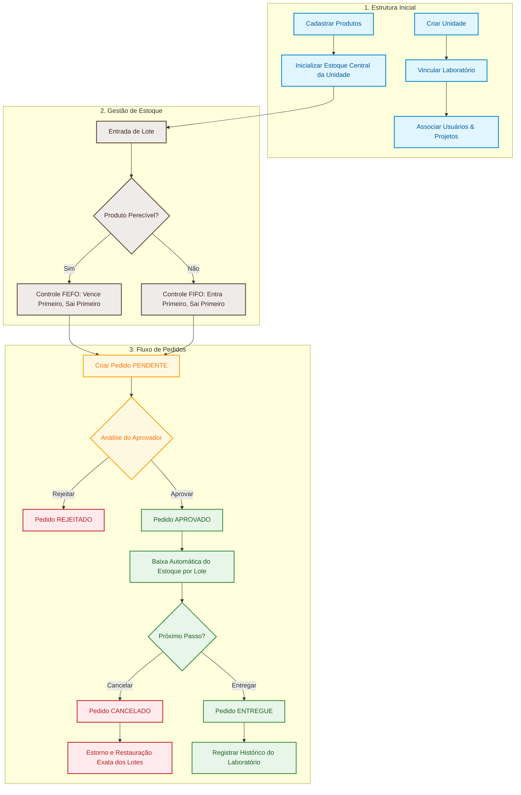

# SGL — Sistema de Gestão de Laboratórios

Backend para gestão de unidades, laboratórios, usuários, projetos, produtos, estoque central, lotes, movimentações e pedidos de materiais.

O sistema foi estruturado para manter rastreabilidade de estoque por lote, controle de validade, fluxo de aprovação de pedidos e histórico do que foi efetivamente entregue aos laboratórios.

## Estado atual

O backend está funcional e a arquitetura principal do domínio já foi estabilizada.

Já estão implementados:

- cadastro de unidades e laboratórios;
- usuários e perfis;
- produtos e classificação de perecibilidade;
- estoque central por `Unidade + Produto`;
- controle físico por lotes;
- validade por lote;
- FEFO para produtos perecíveis;
- FIFO para produtos não perecíveis;
- descarte de lotes vencidos;
- rastreabilidade das movimentações;
- pedidos com aprovação, entrega, rejeição e cancelamento;
- restauração exata dos lotes no cancelamento de pedido aprovado;
- projetos vinculados a laboratórios;
- consulta de pedidos por Projeto + Laboratório + período;
- consulta de materiais efetivamente recebidos por Projeto + Laboratório + período;
- testes automatizados do domínio principal.

A etapa atual é a migração definitiva do ambiente de desenvolvimento para **PostgreSQL + Flyway**.

A conexão com PostgreSQL já foi validada e o Flyway já está integrado. A próxima tarefa é construir a migration inicial `V1__create_initial_schema.sql` a partir das entidades existentes.

## Tecnologias

- Java 21
- Spring Boot 4.1
- Spring Data JPA
- Hibernate
- Spring Security
- Bean Validation
- PostgreSQL
- Flyway
- H2 para testes automatizados
- JUnit
- Mockito
- Lombok
- Maven

## Arquitetura

```text
Requisição HTTP
    ↓
Controller
    ↓ DTO
Service
    ↓ Entity
Repository
    ↓
Banco de dados
```

Responsabilidades principais:

- `controller`: endpoints REST;
- `dto`: contratos de entrada e saída;
- `service`: regras de negócio e transações;
- `repository`: persistência e consultas;
- `model`: entidades e relacionamentos;
- `exception`: tratamento centralizado de erros;
- `config`: segurança e configurações da aplicação.

## Modelo do domínio

```text
Unidade
├── Laboratórios
├── Usuários
└── Estoque Central
    └── Produto
        └── Lotes

Laboratório
├── Usuários
├── Projetos
├── Pedidos
└── Histórico de materiais recebidos
```

### Estoque Central

`EstoqueCentral` representa o saldo agregado de um produto dentro de uma unidade.

Identificação lógica:

```text
Unidade + Produto
```

Regra central de consistência:

```text
EstoqueCentral.quantidadeAtual
=
soma de Lote.quantidadeDisponivel
```

### Lote

`Lote` representa uma entrada física rastreável do estoque.

Cada lote possui seu próprio saldo e, quando o produto é perecível, sua própria data de validade.

```text
Produto
→ define se é perecível

Lote
→ guarda quantidade física
→ guarda validade quando aplicável
```

## 🚀 Fluxo de Funcionamento e Guia de Uso

Para facilitar a compreensão do comportamento do **SGL**, abaixo apresentamos a representação visual do ciclo de vida das operações do sistema e um guia prático simulando a utilização real dos endpoints da API.

### 📊 Diagrama de Ciclo de Vida do SGL (Mermaid)

Este diagrama detalha o caminho lógico percorrido no sistema, desde as configurações e cadastros iniciais até a entrega final ou cancelamento de pedidos de materiais:



---

### 📖 Guia de Uso Passo a Passo (Simulação da API)

Siga a sequência lógica abaixo para simular o funcionamento prático do SGL usando os endpoints REST do sistema:

<details>
<summary><b>Passo 1: Preparação do Ambiente (Unidade, Laboratório e Produto)</b></summary>
<br>

Antes de movimentar estoque ou solicitar itens, cadastramos a estrutura base do sistema.

1. **Criar a Unidade** (Ex: Unidade Central):
   - **Endpoint:** `POST /api/v1/unidades`
   - **Payload de Exemplo:**
     ```json
     {
       "nome": "Unidade Central de Biotecnologia",
       "sigla": "UCB"
     }
     ```
   
2. **Criar o Laboratório** vinculado à unidade criada:
   - **Endpoint:** `POST /api/v1/laboratorios`
   - **Payload de Exemplo:**
     ```json
     {
       "nome": "Laboratório de Virologia",
       "descricao": "Pesquisas avançadas em vírus",
       "unidadeId": 1
     }
     ```

3. **Cadastrar o Produto** no catálogo global:
   - **Endpoint:** `POST /api/v1/produtos`
   - **Payload de Exemplo:**
     ```json
     {
       "nome": "Álcool Isopropílico 99%",
       "codigoReferencia": "ALC-ISO-99",
       "unidadeMedida": "LITRO",
       "perecivel": true,
       "tipoPerecivel": "REAGENTE"
     }
     ```
</details>

<details>
<summary><b>Passo 2: Abastecendo o Estoque (Entrada de Lotes)</b></summary>
<br>

O estoque no SGL é controlado por lotes físicos rastreáveis. Para abastecer a Unidade com o Produto cadastrado, fazemos uma entrada de lote.

- **Endpoint:** `POST /api/v1/lotes/entrada`
- **Payload de Exemplo:**
  ```json
  {
    "produtoId": 1,
    "unidadeId": 1,
    "numeroLote": "LOT-2026-A",
    "quantidade": 50.0,
    "dataValidade": "2027-12-31"
  }
  ```

*O que o sistema faz por baixo dos panos:*
- Incrementa a quantidade no `EstoqueCentral` daquela `Unidade + Produto`.
- Registra uma movimentação em `MovimentacaoEstoque` com o tipo `ENTRADA`.
</details>

<details>
<summary><b>Passo 3: Realizando uma Solicitação (Pedido PENDENTE)</b></summary>
<br>

Com estoque disponível, os usuários do laboratório podem realizar pedidos de materiais.

- **Endpoint:** `POST /api/v1/pedidos`
- **Payload de Exemplo:**
  ```json
  {
    "usuarioId": 2, // ID do solicitante (deve pertencer ao laboratório)
    "laboratorioId": 1,
    "projetoId": 1, // Projeto opcional vinculado
    "itens": [
      {
        "produtoId": 1,
        "quantidadeSolicitada": 10.0
      }
    ]
  }
  ```

*Estado do sistema:*
- O pedido é registrado com o status `PENDENTE`.
- **Nenhum estoque é reduzido ainda** nesta etapa, garantindo que o saldo só baixe após a aprovação formal do responsável.
</details>

<details>
<summary><b>Passo 4: Processo de Aprovação e Baixa Inteligente (FEFO/FIFO)</b></summary>
<br>

O responsável analisa o pedido pendente e decide aprová-lo.

- **Endpoint:** `POST /api/v1/pedidos/{id}/aprovar`
- **Payload de Exemplo:**
  ```json
  {
    "usuarioAprovadorId": 1,
    "itensAprovados": [
      {
        "itemPedidoId": 1,
        "quantidadeAprovada": 10.0
      }
    ]
  }
  ```

*O que o sistema faz por baixo dos panos:*
1. **Seleção Inteligente de Lote:** Como o produto é perecível, o sistema aplica a regra **FEFO** (First Expire, First Out), selecionando e deduzindo o saldo do lote mais próximo do vencimento (`LOT-2026-A`).
2. **Registro de Auditoria:** Cria uma movimentação em `MovimentacaoEstoque` com o tipo `SAIDA` e origem `PEDIDO`.
3. **Mudança de Status:** O pedido passa para o status `APROVADO`.
</details>

<details>
<summary><b>Passo 5: Entrega Física e Encerramento</b></summary>
<br>

Após a separação física do reagente no almoxarifado, ele é entregue ao laboratório de destino.

- **Endpoint:** `POST /api/v1/pedidos/{id}/entregar`

*Resultado final:*
- O status do pedido muda para `ENTREGUE`.
- O sistema registra um histórico em `HistoricoLaboratorio` contendo o que o laboratório e o projeto receberam de fato.
- Nenhuma alteração no estoque é realizada nesta etapa, pois o saldo já foi debitado na aprovação.
</details>

<details>
<summary><b>Passo 4.1: Cancelamento e Devolução Segura (Se aplicável)</b></summary>
<br>

Caso um pedido `APROVADO` seja cancelado antes de ser entregue:

- **Endpoint:** `POST /api/v1/pedidos/{id}/cancelar`

*Estorno e Auditoria:*
- O status do pedido passa para `CANCELADO`.
- O sistema rastreia as movimentações do pedido e **restaura exatamente a quantidade que havia sido debitada** aos lotes de origem, gerando uma movimentação do tipo `DEVOLUCAO`.
</details>

---

## FEFO e FIFO

Produtos perecíveis utilizam **FEFO — First Expire, First Out**:

```text
primeiro a vencer
→ primeiro a sair
```

Produtos não perecíveis utilizam **FIFO — First In, First Out**:

```text
primeiro a entrar
→ primeiro a sair
```

Lotes vencidos não podem atender saídas normais e seguem para descarte.

Uma única saída pode consumir vários lotes. Cada lote afetado gera sua própria `MovimentacaoEstoque`.

## Movimentações de estoque

`MovimentacaoEstoque` funciona como registro de auditoria.

Cada movimentação pode registrar:

```text
produto
lote
quantidade
pedido
laboratório
usuário responsável
saldo anterior
saldo posterior
```

O `MovimentacaoEstoqueService` centraliza as operações físicas:

```text
entrada por lote
saída FEFO/FIFO
descarte
devolução/restauração
```

## Fluxo de pedido

```text
PENDENTE
├── APROVADO
│   ├── ENTREGUE
│   └── CANCELADO
└── REJEITADO
```

### Aprovação

```text
PedidoService
→ valida pedido e quantidades
→ localiza o EstoqueCentral
→ delega a saída ao MovimentacaoEstoqueService
→ FEFO/FIFO seleciona os lotes
→ reduz saldo dos lotes
→ reduz saldo agregado
→ registra uma SAIDA por lote
→ pedido fica APROVADO
```

### Entrega

Na entrega, o estoque não é baixado novamente.

```text
pedido APROVADO
→ cria HistoricoLaboratorio
→ pedido fica ENTREGUE
```

### Cancelamento

Ao cancelar um pedido já aprovado, o sistema consulta as movimentações realizadas e restaura exatamente os lotes utilizados.

## Consultas por projeto

O sistema separa duas informações diferentes:

```text
pedidos realizados
versus
materiais efetivamente recebidos
```

### Pedidos realizados

```http
GET /api/v1/pedidos/laboratorio/{laboratorioId}/projeto/{projetoId}/periodo?dataInicio=AAAA-MM-DD&dataFim=AAAA-MM-DD
```

Consulta os pedidos criados para um projeto em determinado laboratório e período, independentemente do status.

### Materiais efetivamente recebidos

```http
GET /api/v1/historico-laboratorio/laboratorio/{laboratorioId}/projeto/{projetoId}/periodo?dataInicio=AAAA-MM-DD&dataFim=AAAA-MM-DD
```

Consulta somente o que foi efetivamente entregue ao laboratório.

As consultas validam:

- existência do laboratório;
- existência do projeto;
- vínculo entre projeto e laboratório;
- `dataInicio <= dataFim`.

## Módulos principais

| Módulo | Papel |
|---|---|
| Unidade | Agrupa laboratórios, usuários e estoques |
| Laboratório | Agrupa projetos, usuários, pedidos e histórico |
| Usuário | Usuários e perfis do sistema |
| Estagiário | Especialização de usuário |
| Produto | Catálogo global de materiais |
| EstoqueCentral | Saldo agregado por Unidade + Produto |
| Lote | Entrada física rastreável e saldo individual |
| MovimentacaoEstoque | Auditoria das operações físicas |
| Projeto | Contexto de pesquisa e vínculo com laboratório |
| Pedido | Solicitação e fluxo de aprovação |
| ItemPedido | Itens e quantidades solicitadas/aprovadas |
| HistoricoLaboratorio | Materiais efetivamente entregues |

## Regras importantes

- `unidade_id + produto_id` deve ser único no estoque;
- estoque novo nasce com quantidade zero;
- toda entrada física cria ou alimenta um lote rastreável;
- produto perecível exige validade no lote;
- perecível usa FEFO;
- não perecível usa FIFO;
- lote vencido não atende pedido;
- estoque nunca pode ficar negativo;
- aprovação reduz apenas a quantidade aprovada;
- entrega não reduz estoque novamente;
- cancelamento aprovado restaura exatamente os lotes utilizados;
- histórico do laboratório representa recebimento efetivo;
- consultas por projeto validam o vínculo Projeto → Laboratório.

## Banco de dados e ambientes

A configuração está separada por profile:

```text
application.properties
→ configurações gerais

application-dev.properties
→ PostgreSQL + Flyway

application-test.properties
→ H2 em memória para testes
```

Durante o desenvolvimento local, o profile `dev` está temporariamente definido como padrão para facilitar a execução pelo Eclipse.

```properties
spring.profiles.active=dev
```

Essa configuração deverá ser removida quando houver ambiente de produção. Nesse cenário, o profile deverá ser informado externamente pelo ambiente de execução.

As credenciais do PostgreSQL são fornecidas por variáveis de ambiente e não devem ser versionadas.

Exemplo:

```properties
spring.datasource.url=${DB_URL:jdbc:postgresql://localhost:5432/sgl}
spring.datasource.username=${DB_USER:postgres}
spring.datasource.password=${DB_PASSWD:}
```

## PostgreSQL e Flyway

A conexão com PostgreSQL já foi validada no profile `dev`.

O Flyway também foi inicializado e criou sua tabela de controle:

```text
flyway_schema_history
```

O ambiente PostgreSQL utiliza:

```properties
spring.jpa.hibernate.ddl-auto=validate
```

Com isso:

```text
Flyway
→ cria e evolui o schema

Hibernate
→ valida se o schema corresponde às entidades
```

A próxima migration será:

```text
src/main/resources/db/migration/V1__create_initial_schema.sql
```

Ela será construída entidade por entidade, respeitando a ordem das chaves estrangeiras.

## Testes

A suíte automatizada atual possui **20 testes passando**, sem falhas ou erros.

Execução:

```bash
cd backend/sgl-backend
mvn test
```

Os testes de contexto utilizam o profile `test`, mantendo H2 isolado do PostgreSQL local.

## Executar o backend

Entre no diretório:

```bash
cd backend/sgl-backend
```

Defina as variáveis de ambiente do PostgreSQL e execute:

```bash
mvn spring-boot:run
```

API local:

```text
http://localhost:8080
```

Enquanto a migration inicial ainda não estiver concluída, o Hibernate poderá interromper a inicialização informando tabelas ausentes. Esse comportamento é esperado porque `ddl-auto=validate` está ativo.

## Autenticação

A autenticação definitiva será integrada posteriormente com a infraestrutura corporativa.

Enquanto essa integração não estiver disponível, está planejada uma autenticação local simulada para desenvolvimento e testes.

Ela também permitirá substituir gradualmente os `usuarioId` temporários dos endpoints auditáveis por um usuário obtido do contexto autenticado.

## Próximas etapas

1. Criar `V1__create_initial_schema.sql`.
2. Construir a migration inicial entidade por entidade.
3. Aplicar a V1 no PostgreSQL.
4. Validar o schema com Hibernate.
5. Ajustar `DataInitializer` para desenvolvimento local.
6. Reexecutar testes automatizados e roteiro Postman com PostgreSQL.
7. Criar testes de integração e concorrência.
8. Implementar autenticação local simulada.
9. Remover `usuarioId` temporário dos endpoints auditáveis.
10. Registrar `DEVOLUCAO` com usuário executor real.
11. Adicionar OpenAPI/Swagger.
12. Iniciar frontend.

## Documentação

- [`CONTINUIDADE.md`](CONTINUIDADE.md): estado técnico atual e próximos passos;
- [`docs/ENDPOINTS_INTERNOS.md`](docs/ENDPOINTS_INTERNOS.md): inventário dos endpoints;
- [`docs/testes.md`](docs/testes.md): roteiro de validação manual;
- [`docs/FLUXO_DO_SISTEMA.md`](docs/FLUXO_DO_SISTEMA.md): fluxo do sistema;
- [`docs/GUIA_ESTRUTURAL.md`](docs/GUIA_ESTRUTURAL.md): organização e responsabilidades das classes;
- [`docs/diagrama-uml-completo.puml`](docs/diagrama-uml-completo.puml): modelo do domínio.

## Responsável

Gabriel Salermo
