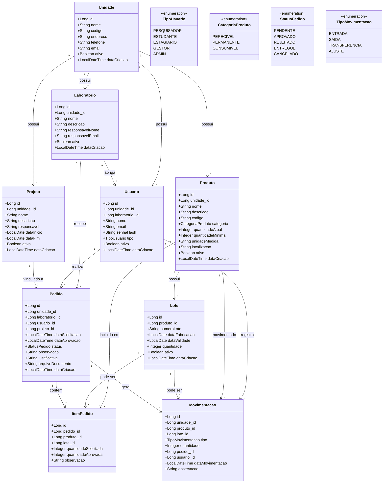
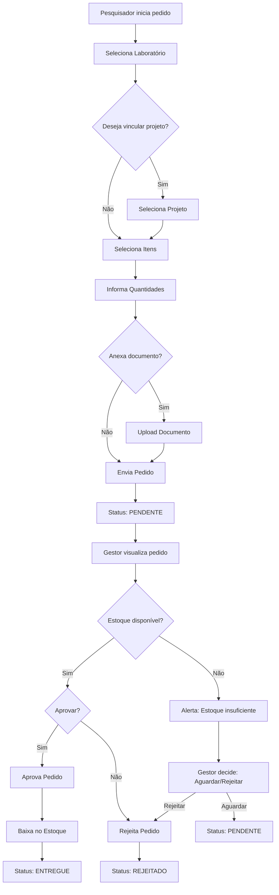
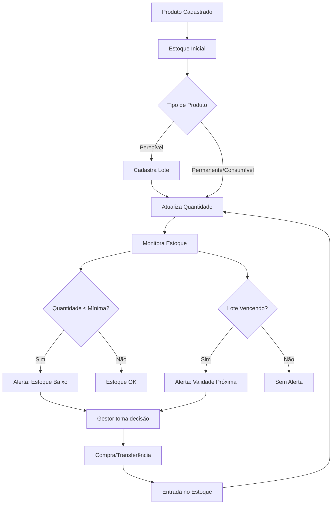

# 📊 Diagrama UML - Projeto STOCK

## Diagrama de Classes

---

## Descrição dos Relacionamentos

| Relacionamento | Cardinalidade | Descrição |
|----------------|---------------|-----------|
| Unidade → Laboratório | 1:N | Uma unidade possui vários laboratórios |
| Unidade → Usuário | 1:N | Uma unidade possui vários usuários |
| Unidade → Produto | 1:N | Uma unidade possui vários produtos |
| Unidade → Projeto | 1:N | Uma unidade possui vários projetos |
| Laboratório → Usuário | 1:N | Um laboratório abriga vários usuários |
| Laboratório → Pedido | 1:N | Um laboratório recebe vários pedidos |
| Usuário → Pedido | 1:N | Um usuário realiza vários pedidos |
| Usuário → Movimentação | 1:N | Um usuário registra várias movimentações |
| Produto → Lote | 1:N | Um produto pode ter vários lotes |
| Produto → ItemPedido | 1:N | Um produto pode estar em vários pedidos |
| Produto → Movimentação | 1:N | Um produto pode ser movimentado várias vezes |
| Lote → ItemPedido | 1:N | Um lote pode estar em vários pedidos |
| Lote → Movimentação | 1:N | Um lote pode ser movimentado várias vezes |
| Projeto → Pedido | 1:N | Um projeto pode ter vários pedidos |
| Pedido → ItemPedido | 1:N | Um pedido contém vários itens |
| Pedido → Movimentação | 1:N | Um pedido gera várias movimentações |

---

## Enumerações

### TipoUsuario
| Valor | Descrição |
|-------|-----------|
| PESQUISADOR | Pesquisador do laboratório |
| ESTUDANTE | Estudante vinculado ao laboratório |
| ESTAGIARIO | Estagiário do laboratório |
| GESTOR | Departamento de Gestão |
| ADMIN | Administrador da Unidade |

### CategoriaProduto
| Valor | Descrição |
|-------|-----------|
| PERECIVEL | Produto com validade (usa lotes) |
| PERMANENTE | Produto de uso contínuo |
| CONSUMIVEL | Produto que acaba com o uso |

### StatusPedido
| Valor | Descrição |
|-------|-----------|
| PENDENTE | Aguardando aprovação |
| APROVADO | Aprovado pelo gestor |
| REJEITADO | Rejeitado pelo gestor |
| ENTREGUE | Material entregue |
| CANCELADO | Pedido cancelado |

### TipoMovimentacao
| Valor | Descrição |
|-------|-----------|
| ENTRADA | Material entra no estoque |
| SAIDA | Material sai do estoque |
| TRANSFERENCIA | Move entre locais |
| AJUSTE | Correção de quantidade |

---

## Diagrama de Fluxo - Pedido

---

## Diagrama de Fluxo - Estoque

---

## Observações Técnicas

### Chaves Estrangeiras
- `laboratorio.unidade_id` → `unidade.id`
- `usuario.unidade_id` → `unidade.id`
- `usuario.laboratorio_id` → `laboratorio.id`
- `produto.unidade_id` → `unidade.id`
- `lote.produto_id` → `produto.id`
- `projeto.unidade_id` → `unidade.id`
- `pedido.unidade_id` → `unidade.id`
- `pedido.laboratorio_id` → `laboratorio.id`
- `pedido.usuario_id` → `usuario.id`
- `pedido.projeto_id` → `projeto.id` (nullable)
- `item_pedido.pedido_id` → `pedido.id`
- `item_pedido.produto_id` → `produto.id`
- `item_pedido.lote_id` → `lote.id` (nullable)
- `movimentacao.unidade_id` → `unidade.id`
- `movimentacao.produto_id` → `produto.id`
- `movimentacao.lote_id` → `lote.id` (nullable)
- `movimentacao.pedido_id` → `pedido.id` (nullable)
- `movimentacao.usuario_id` → `usuario.id`

### Índices Recomendados
- `unidade.codigo` (único)
- `laboratorio.unidade_id`
- `usuario.unidade_id`
- `usuario.email` (único por unidade)
- `produto.unidade_id`
- `produto.categoria`
- `lote.produto_id`
- `lote.data_validade`
- `pedido.unidade_id`
- `pedido.laboratorio_id`
- `pedido.usuario_id`
- `pedido.status`
- `pedido.data_solicitacao`
- `movimentacao.unidade_id`
- `movimentacao.produto_id`
- `movimentacao.data_movimentacao`
